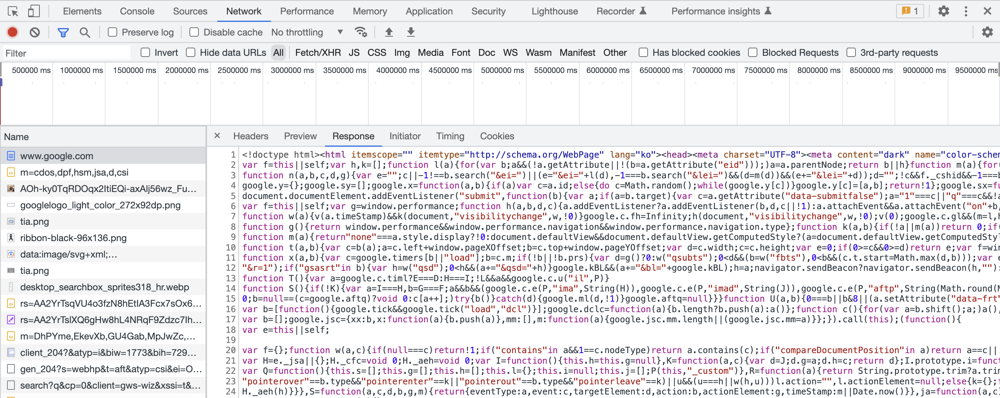
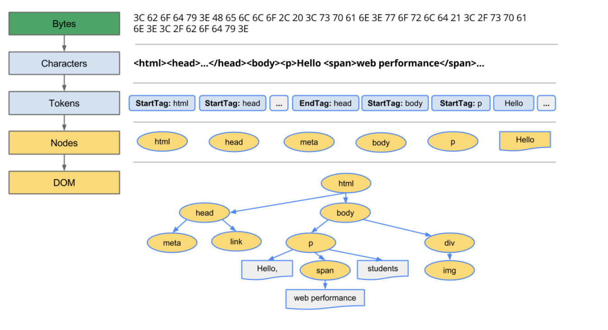
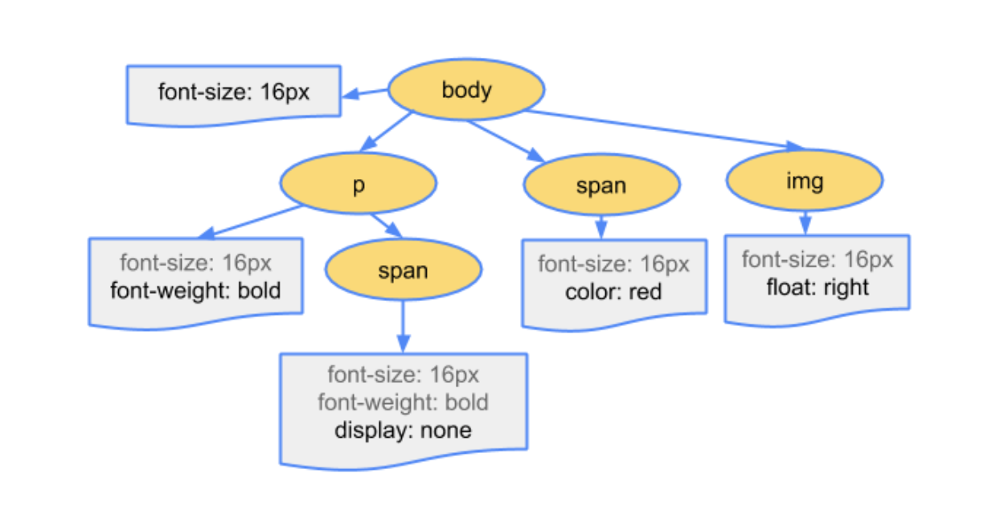
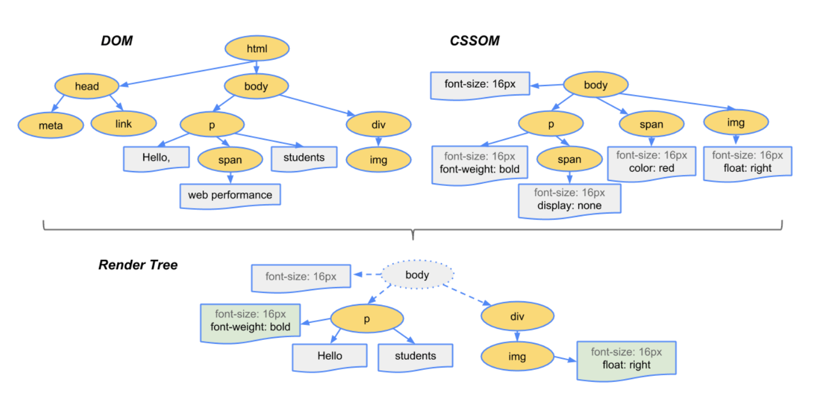

# 브라우저가 웹페이지를 렌더링하는 과정

## 브라우저

브라우저가 웹페이지를 렌더링하는 과정을 알아보기전에 브라우저가 무엇인지 간단히 짚고 넘어가도록 하겠습니다.

우선 브라우저는 우리가 흔히 인터넷에 접속할 때 사용하는 Chrome, Safari, Firefox 등을 말합니다.

MDN에서는 이렇게 설명하고 있습니다.

:::info
웹 브라우저 또는 브라우저는 웹에서 페이지를 찾아서 보여주고, 사용자가 하이퍼링크를 통해 다른 페이지로 이동할 수 있도록 하는 프로그램입니다. 브라우저는 가장 익숙한 타입의 사용자 에이전트입니다.
:::

브라우저는 유저가 선택한 자원을 서버로부터 받아와서 유저에게 보여줍니다. 자원은 페이지 외에도 이미지, 비디오 등의 콘텐츠들도 포함됩니다.

## 브라우저 렌더링 과정

렌더링의 기본 동작 과정은 크게 다섯단계로 나눌 수 있습니다.

> 1.  HTML과 CSS파일을 파싱해서 각각 DOM, CSSOM을 생성하는 **Parsing단계**
> 2.  두 트리를 합쳐 렌더트리를 만드는 **Style단계**
> 3.  렌더 트리에서 각 노드의 위치와 크기를 계산하는 **Layout단계**
> 4.  계산된 값을 이용해 각 노드를 화면상에 실제 픽셀로 변환하고 레이어를 만드는 **Paint단계**
> 5.  레이어를 합성하여 실제 화면에 보여주는 **Composite단계**

이제 각 단계를 자세히 살펴보도록 하겠습니다.

### Parsing

파싱이란 프로그래밍 언어로 작성된 파일을 실행시키기 위해 `구문 분석`을 하는 단계입니다.
파일의 문자열들을 문법적 의미를 갖는 최소 단위인 '토큰'으로 분해하고, 이 토큰들을 문법적 의미와 구조에 따라 노드라는 요소로 만듭니다. 노드들은 상하관계를 반영해 트리를 형성하는데, 이 트리를 파스트리라고 합니다.

#### HTML 파싱, DOM 생성

파싱을 하기 위해선 먼 브라우저에 필요한 리소스를 서버로부터 `요청`하고 `응답`받아야합니다.
서버에 요청을 하기 위해서는 어떻게 해야 할까요? 바로 브라우저에 있는 주소창을 통해 요청을 보낼수있습니다.
주소창에 URL을 입력하고 엔터키를 누르면, URL의 호스트 이름이 DNS(도메인 네임 서비스)를 통해 진짜 주소인 IP주소로 변환되고, 이 IP주소를 갖는 서버에게 요청을 보내게 됩니다. 서버는 기본적으로 index.html을 응답으로 주도록 설정되어있습니다.
예를들어 `https://google.com` 을 검색하면 `https://google.com/index.html`을 요청하는 것과 동일합니다.

그렇게 응답으로 받아온 HTML 문서는 오직 `텍스트`로만 구성되어있습니다. 이 문서를 브라우저가 이해할 수 있는 형태로 바꾸는 작업이 필요한데 이 형태가 바로 `DOM 구조`입니다.

서버에서 받아온 파일을 브라우저가 이해하기 위한 과정을 간략하게 살펴보겠습니다.

1. 서버는 브라우저에게 이진수 형태의 HTML 문서를 응답으로 줍니다.
2. 문서는 `<meta>`의 `charset속성`에 지정된 방식의 문자열로 인코딩 됩니다. (UTF-8)
3. 문자열 형태의 HTML문서를 '토큰'단위로 분해합니다. (문법적 의미를 갖는 코드의 최소 단위)
4. 각 토큰을 객체로 변환해, 노드를 생성합니다.(DOM을 구성하는 기본 요소)
5. HTML문서의 요소들의 중첩관계를 기반으로 노드들을 트리 구조로 구성합니다. 이 트리를 `DOM`이라고 합니다.

위와 같은 과정을 거쳐서 HTML문서가 파싱되고 **DOM**이라는 결과물을 생성합니다. 이렇게 복잡한 과정을 거치는 이유는 무엇일까요? 브라우저는 JavaScript 언어만 알아들을 수 있기 때문입니다. `DOM`은 `Document Object Model`의 줄임말로 문서 객체 모델입니다. JavaScript는 HTML의 태그나 속성들을 바로 다룰 수 없기 때문에 다룰 수 있는 형태인 `'객체'`로 바꿔주어야합니다. 그래야 브라우저 또한 HTML문서를 이해할 수 있게 되는 것 입니다.

#### CSS 파싱, CSSOM 생성

HTML을 파싱하다가 `<link>`, `<style>` 태그를 만나면 파싱을 잠시 멈추고 리소스파일을 서버로 요청하게 됩니다. 이 태그들은 CSS 파일을 가져올 때 사용하는데, 이렇게 가져온 CSS파일 또한 HTML과 동일하게 파싱을 하게됩니다. 이렇게 만들어진 트리가 바로 **CSSOM** 입니다.

**CSSOM** 또한 `CSS Object Model`의 줄임말로 CSS문서를 객체 모델로 바꾼 것 입니다. CSSOM 구성을 다 하고나면 파서는 다시 멈췄던 부분으로 돌아가 HTML을 파싱하게됩니다.

#### JavaScript 파싱

동일하게 HTML을 한줄 한줄 파싱하다 `<script>` 태그를 만나게 되면 파싱을 또 멈추고 `src속성`에 있는 파일을 서버에 요청하게 됩니다. 서버로부터 받아온 js파일또한 파싱을 하게되는데 이 파싱은 **브라우저 렌더링 엔진**이 아닌 **JS엔진**이 담당하게 됩니다. 이때 브라우저 렌더링 엔진은 파싱 제어권을 아예 JS엔진에게 넘겨주기 때문에 js파싱이 다 끝난 뒤에야 다시 제어권을 넘겨받아 나머지 HTML을 파싱하게 됩니다.

이렇게 모든 파싱을 끝내면 **DOM**과 **CSSOM**을 생성하게 됩니다.

### Style 렌더트리 생성

DOM은 HTML구조를 담당하고, CSSOM은 CSS디자인을 담당합니다. 두 트리는 독립적인 트리이기 때문에 이를 합치는 과정이 필요합니다.

렌더트리는 렌더링을 목적으로 만들어지는 트리입니다. 렌더링은 브라우저가 사용자에게 최종적으로 보여줘야 하는 화면을 그리는 과정이기 때문에, 보이지 않을 요소들은 이 트리에 포함되지 않습니다.
예를 들어 **DOM**의 `<meta>`태그나, **CSSOM**에서 `display:none` 같은 속성값을 가진 노드들은 렌더 트리에서 제외되게 됩니다.

이렇게 하나의 렌더 트리로 합쳐지는 과정을 거치면 이제 브라우저에서 사용자가 화면을 볼 수 있을까요? 안타깝게도 렌더트리 또한 아직 텍스트로 구성된 객체에 지나지 않기 때문에 실제로 보여지는 페이지를 만들기 위해서는 `'페인팅'` 이라는 작업을 거쳐야 합니다.
페인팅 작업은 렌더트리의 노드들이 갖고있는 속성값을 바탕으로 그려지게 됩니다.

### Layout단계 (reflow)

렌더트리에는 각 노드들의 위치나 크기와 관련된 정보들이 들어있습니다. 이 정보들은 각 노드들의 정보일 뿐 화면에서 정확히 어디에 위치해야하는지는 알 수 없습니다. 이런 계산을 하는 단계가 바로 **레이아웃 단계**입니다.
브라우저는 각 요소들이 전체화면에서 어디에, 어떤 크기로 배치되어야 하는지 파악하기 위해 렌더트리의 맨 위부터 순차적으로 내려가며 계산을 합니다. 이때 모든 값들은 절대적인 단위인 px값으로 변환됩니다.

### Painting단계

각 요소들의 위치 값들에 대한 계산이 끝났으므로 이제 페이지에 보여줄 차례입니다. 브라우저는 픽셀이라고하는 아주 작은 단위의 점으로 이루어져있습니다. 이 픽셀들이 모여 하나의 이미지, 화면을 구성하게 됩니다.
페인팅은 이 픽셀들을 채워나가는 과정이라고 생각하시면 됩니다. 이때 픽셀로 변환된 결과는 하나의 레이어가 아닌 여러개의 레이어로 관리됩니다.
당연하게도 스타일이 복잡할수록 페인트 시간 길어지게 됩니다. 단색 배경의 경우 시간과 작업이 적게 소요되지만, 그림자 효과의 경우 더 많은 시간과 작업을 필요로하게 됩니다.

### Composite단계

페인트 단계에서 생성된 레이어를 합성해 실제 화면에 나타내줍니다.

따라서 이 과정을 마지막으로 텍스트로 되어있던 파일을 브라우저를 통해 이미지화 된 모습으로 보게되는 것입니다.

## reflow, repaint 현상

- **reflow**는 생성된 DOM 노드의 레이아웃 변경시 영향을 받는 모든 노드의 수치를 다시 계산해서 레이아웃 트리 즉 렌더 트리를 재생성하는 작업을 말합니다.
  - **reflow**를 발생하게 하는 속성에는 `width`, `height`, `padding`, `margin`, `float`, `position` 등등 레이아웃에 영향을 주는 모든 속성들이라고 할 수 있습니다.
- **repaint**란 reflow 과정이 끝나고 재생성된 레이아웃 트리 즉 렌더 트리를 다시 레이어에 그리는 작업입니다.
  - **repaint**를 발생하게 하는 속성으로는 `color`, `border-radius`, `background`, `box-shadow` 등등 시각적으로 보여지는 모든 속성들이 있습니다.

렌더링과정은 **순차적으로 진행**됩니다. 각각의 렌더링 과정들은 반드시 전 단계의 데이터 필요로하고 만약 전 단계에 변화가 일어난다면 다음 단계에도 모두 영향을 미치게 됩니다. 따라서 리플로우와 리페인트 단계가 많이 일어날 수록 렌더링 성능이 저하됩니다.

이를 방지하는 방법으로는 첫번째 **CSS Transform** 속성을 사용하면 됩니다. transform을 사용해 만드는 애니메이션은 CPU대신 GPU를 사용하여 화면 렌더링을 처리합니다.

두번째 방법으로는 **requestAnimationFrame**함수를 사용합니다. requestAnimationFrame함수는 자바스크립트를 통해 일어나는 애니메이션 정보를 브라우저에 매 프레임마다 미리 알려줍니다. 그렇기 때문에 자바스크립트 애니메이션이 매 프레임의 시작 시 실행되도록 보장할수있습니다.

이렇듯 우리는 단순히 브라우저 주소창에 주소를 검색하지만 그 내부 동작원리를 살펴보면 복잡한 과정들이 굉장히 빠르게 이루어지고 있다는 것을 알 수 있습니다.
아직 깊게 다뤄보지 못한 주제들이 많기 때문에 천천히 작성해 보도록 하겠습니다.

참고

- [https://joooing.tistory.com/entry/rendering](https://joooing.tistory.com/entry/rendering)
- [https://developer.mozilla.org/ko/docs/Glossary/Browser](https://developer.mozilla.org/ko/docs/Glossary/Browser)
- [https://tecoble.techcourse.co.kr/post/2021-10-24-browser-rendering](https://tecoble.techcourse.co.kr/post/2021-10-24-browser-rendering/)
