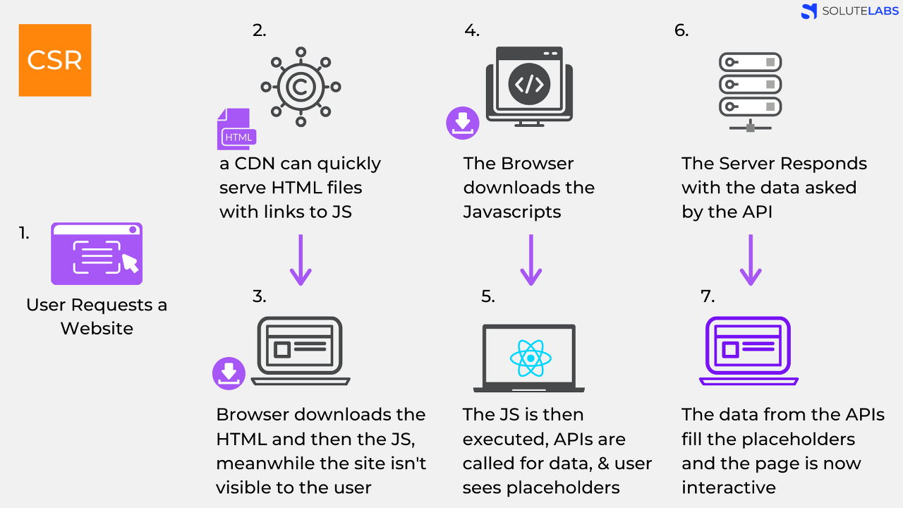
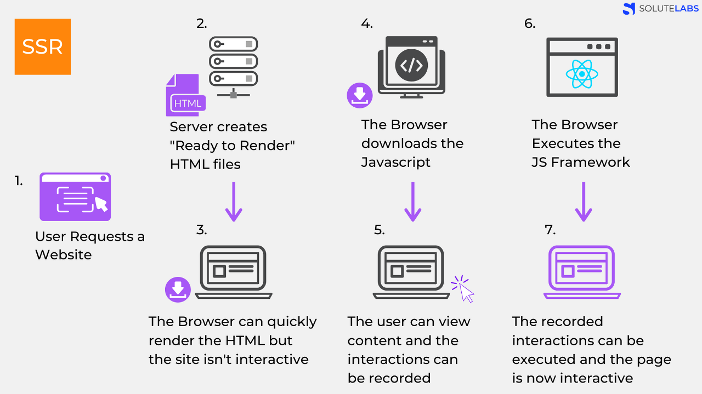

# CSR과 SSR의 차이

- 클라이언트 사이드 렌더링과 서버 사이드 렌더링의 비교

## 브라우저 렌더링이란?

먼저 브라우저 렌더링이란 브라우저가 서버로부터 요청해 받은 파일을 브라우저 화면에 표시해주는 작업을 말합니다.

즉, 브라우저가 서버로부터 HTML, CSS, JS 파일을 전달받아 브라우저 엔진이 각 문서를 해석하고 화면에 그려주는 것입니다.

그리고 이러한 브라우저 렌더링은 크게 'CSR(클라이언트 사이드 렌더링)', 'SSR(서버 사이드 렌더링)' 방식으로 나뉘게 됩니다.

### CSR (Client Side Rendering)이란?

- 클라이언트 사이드 렌더링은 클라이언트인 브라우저가 렌더링을 처리하는 것입니다.

즉, 서버에서 받은 데이터를 통해 **클라이언트인 브라우저가 화면을 그리는 주체**가 되는 것입니다.

그림의 순서는 이렇습니다.

1. user가 website로 요청을 보냅니다.
2. CDN이 HTML파일과 JS로 접근할 수 있는 링크를 클라이언트로 보냅니다.
3. 클라이언트는 HTML과 JS를 다운로드 받습니다.
   - **이때 유저는 아무것도 볼 수 없습니다.**
4. 다운이 완료 된 자바스크립트가 실행되고, 데이터를 위한 API가 호출됩니다.
5. 서버가 요청에 응답하여 데이터를 보내줍니다.
6. 서버로부터 받아온 데이터를 화면에 그려주고, 페이지는 상호작용이 가능해 집니다.

#### 장점

- view렌더링을 브라우저가 담당하게 되므로 서버 트래픽을 감소시키고, 사용자에게 더 빠른 인터렉션을 제공해 줍니다.
- **새로고침이 발생하지 않아 사용자가 네이티브 앱과 유사한 경험을 할 수 있습니다.**

#### 단점

- **첫 페이지 로딩 속도가 서버 사이드 렌더링에 비해 느립니다.**
  - 새로운 페이지를 보려고 할 때마다 모든 것을 서버로부터 요청해 다운받아야 하므로 로딩 속도가 느립니다.
  - 사용자가 많거나 많은 요청을 할 경우 서버에 과부하가 걸릴 수 있습니다.
- **검색 엔진 최적화에 대한 추가 보완 작업이 필요합니다.**
  - 포털사이트 검색엔진 크롤러가 웹 사이트에 대한 데이터를 제대로 수집하지 못하는 경우가 발생할 수 있습니다. 구글의 경우 자바스크립트 엔진이 내장되어 있어 크롤링이 되지만, 네이버나 다음의 경우 검색엔진이 제대로 크롤링하지 못하기 때문에 별도의 보완작업이 필요합니다.

### SSR (Server Side Rendering)이란?

- 서버 사이드 렌더링은 클라이언트인 브라우저가 서버에 매번 데이터를 요청하여 서버에서 받아오는 방식입니다.

즉, 클라이언트에서 요청이 들어올 때마다 매번 서버에서 새로운 화면을 제공해주는 것입니다. 따라서 **서버가 화면을 그리는 주체**가 됩니다.

그림의 순서는 이렇습니다.

1. user가 website에 요청을 보냅니다.
2. 서버는 `Ready to Render`. 즉, 렌더링이 가능한 HTML파일을 만듭니다.
3. 클라이언트에 전달되는 순간, 렌더링이 준비되어 있는 상태기 때문에 HTML은 즉시 렌더링이 됩니다.
   - 그러나 사이트 조작은 불가능합니다. 자바스크립트가 로드되지 않았기때문입니다.
4. 클라이언트가 자바스크립트를 다운로드 합니다.
5. **다운이 받아지는 사이 사용자는 컨텐츠를 볼 수 있지만 조작할 수는 없습니다. 이때 사용자의 조작을 기억하고있습니다.**
6. 브라우저가 자바스크립트 프레임워크를 실행합니다.
7. 자바스크립트까지 성공적으로 컴파일이 완료되면 기억하고 있던 사용자의 조작이 실행되고 웹 페이지는 상호작용이 가능해집니다.

#### 장점

- **첫 페이지 로딩 속도가 클라이언트 사이드 렌더링에 비해 빠릅니다.**
  - 해당하는 첫 페이지만 서버에 요청해 브라우저가 렌더링하면 되기 때문에 초기 로딩 속도가 빠릅니다.
- **검색 엔진 최적화가 가능합니다.**
  - 렌더링 가능한 문서를 서버에서 보내주기 때문입니다.

#### 단점

- **초기 로딩 이후 페이지 이동 시 속도가 다소 느립니다.**
  - 페이지 이동 시마다 클라이언트가 서버에 필요한 데이터를 요청하고 서버가 응답해주는 방식이다보니 속도가 다소 느립니다.

### TTV, TTI

**CRA**는 `TTV(Time To View)`. 즉, 사용자가 웹사이트를 볼 수 있음과 동시에 `TTI(Time To Interact)`, 클릭하거나 인터랙션이 가능하게 됩니다.

반면, **SSR**은 웹 서비스 접속시 서버에서 만들어진 index.html 파일을 받아오게 되니 사용자가 웹 컨텐츠를 볼 수 있지만 자바스크립트 파일은 받아오지 않았으므로 동적으로 제어는 불가능합니다. 최종적으로 자바스크립트 파일을 모두 받아온 뒤에야 인터랙션이 가능해집니다.

따라서 **SSR**은 사용자가 사이트를 볼 수 있는 시간과 실제로 상호작용 할 수 있는 시간의 공백이 꽤 긴 편입니다.

웹 사이트가 상호작용이 별로 없는 사이트라면 SSR을 고려해볼 수 있을 것입니다. 반대로 사용자와 상호작용할 것들이 많다면 CSR을 고려해보아야 합니다.

이 밖에도 상황에 따라서 CSR, SSR을 적절히 사용해야하며 **SSG**라는 것도 있습니다.

### SSG (Static Site Generation)

#### React + Gatsby

- 리액트의 경우 **CSR**에 특화되어있지만 개츠비와 함께 사용할 경우 정적으로 웹 페이지를 생성해 서버에 미리 배포해둘 수 있습니다.
- 이렇게 만들어진 웹 사이트 들은 모두 정적인 것은 아니며, 추가적인 데이터 요청이나 동적으로 처리해야하는 로직은 자바스크립트 파일을 함께 가지고 있기 때문에 동적인 요소도 추가할 수 있습니다.

#### React + Next.js

- 개츠비 다음으로 많이 사용되는 것이 바로 `Next.js`입니다.
- `Next.js`는 **SSR**만을 지원했는데 요즘에는 **SSG**도 지원이 되어 **CSR**과 **SSR**을 잘 통합하여 조금 더 강력하고 유연하게 목적에 맞게 사용할 수 있도록 지원해주고 있습니다.
